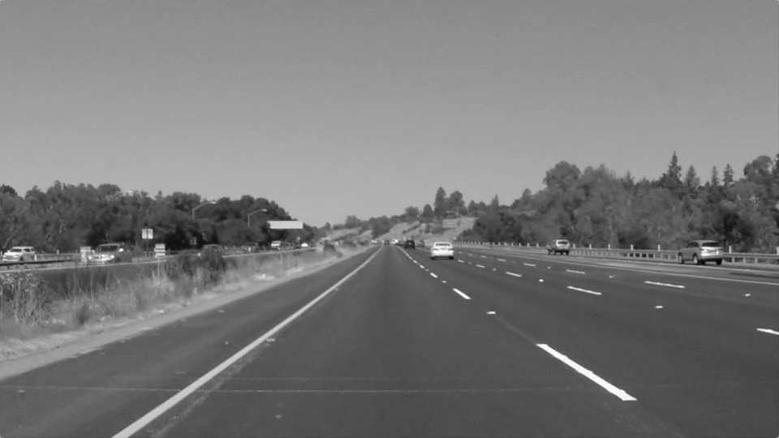
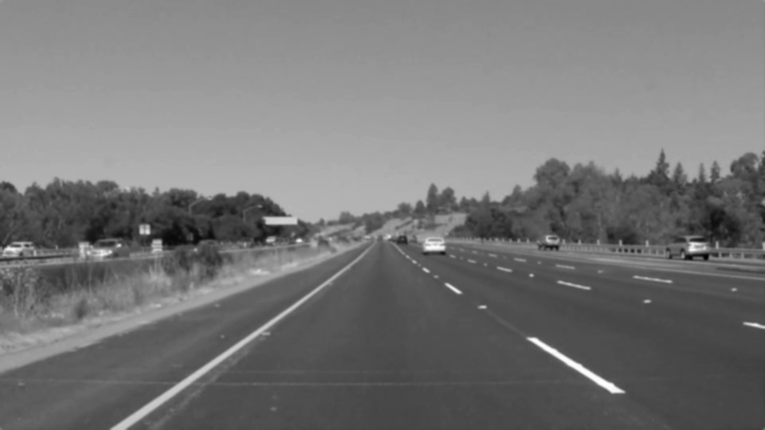
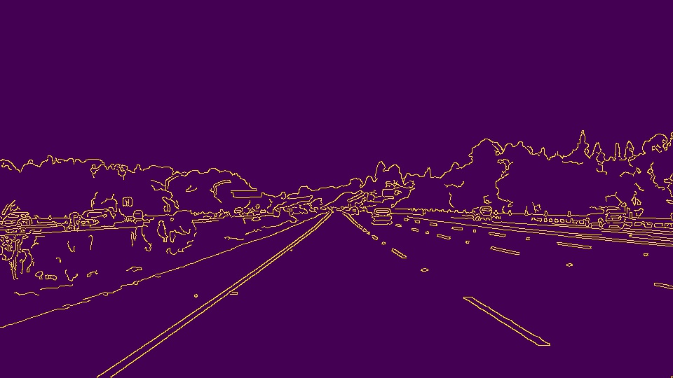
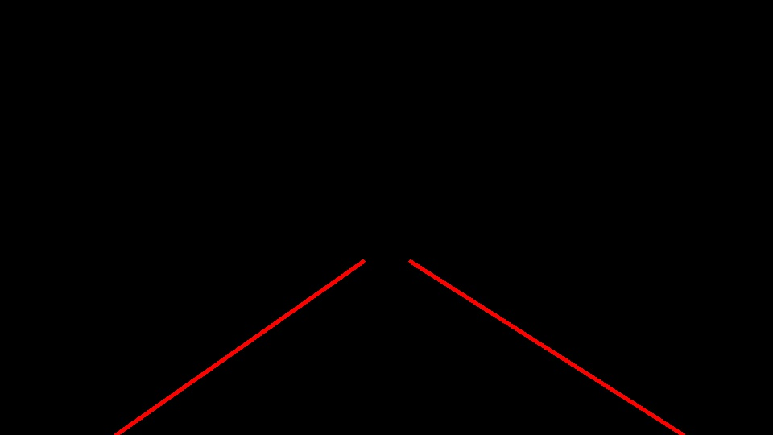

# **Finding Lane Lines on the Road** 

The goals / steps of this project are the following:
* Make a pipeline that finds lane lines on the road
* Reflect on your work in a written report

## Project Content
The Project consists of the following files and folders:
- test_images            (consists of the test images)
- test_images_output     (consists of the output images)
- test_videos            (consists of the test videos)
- test_videos_output     (consists of the output videos)
- P1.html                (the html-page that presents the output of the project)
- P1.ipynb               (the notebook with the project code)
- writeup.ipynb          (the current file)

[//]: # (Image References)

[original]: ./test_images_output/5_0_original.jpg "Original solidYellowLeft.jpg"
[gray]: ./test_images_output/5_1_gray.jpg "Gray solidYellowLeft.jpg"
[blur]: ./test_images_output/5_2_blur_gray.jpg "Blur solidYellowLeft.jpg"
[canny]: ./test_images_output/5_3_canny.jpg "Canny solidYellowLeft.jpg"
[region]: ./test_images_output/5_4_region.jpg "Region solidYellowLeft.jpg"
[hough]: ./test_images_output/5_5_hough.jpg "Hough solidYellowLeft.jpg"

---

## Reflection
Reflection describes the current pipeline, identifies its potential shortcomings and suggests possible improvements.

### 1. Pipeline
My pipeline consists of 5 steps which I present based on image *solidYellowLeft.jpg*:

First, I convert the images to gray scale,

then I apply the Gaussian smoothing with `kernel_size = 5`

I use canny to find the edges using `low_threshold = 33` and `high_threshold = 100`

In order to analyze only the relevant part of the images, I choose the region with 4 vertices masking everything else out outside this region. This region is relative to the image size.

As a final step, I select the relevant lines by adjusting the hough space parameters and choosing reasonable values of the line slopes:

|Parameter      |     Value     |Description    |
|:-------------|:-------------:|:---------------|
|rho |2                 |distance resolution in pixels of the Hough grid |
    |theta | pi / 180       |angular resolution in radians of the Hough grid |
    |threshold | 50|minimum number of votes (intersections in Hough grid cell) |
    |min_line_length |40    |minimum number of pixels making up a line |
    |max_line_gap | 25 |the maximum distance between segments that should be connected into a  line |

After testing images, I try the pipeline on the provided test videos. It works pretty well.

#### Function *draw_lines()*
The key part of the pipeline is the draw_lines() function. In order to draw a single line on the left and right lanes, I modify the draw_lines() function by adding the slope calculation. I use the slope to distinguish the left and right lane lines. Based on the slope, I exclude the lines which cannot be the lane lines (the lines close to horizontal with slope between -0.3 and 0.3 are excluded).

The draw_lines function also includes linear extrapolation that allows us to draw lines throughout the whole region of interest.

#### Challenge
I fine-tune the parameters further to make the pipeline working on challenge video. The thresholds for the canny method are therefore chosen to be low. This is done in order to recognize left yellow line on the bright video. Moreover, I choose the region of interest to be relative to the image size since the resolution in this case differs from the test images and videos.

### 2. Shortcomings with pipeline
As the challenge video shows, the shortcoming of the current approach is the curvy lane. The chosen hough space method can badly evaluate curves.

Another shortcoming could be the brightness of the video, especially when there are shadows on the road. The algorithm cannot really recognize the line patterns.

### 3. Possible improvements to pipeline

First of all, I would not use hough space in this case, but rather an algorithm that can recognize and evaluate curves.

Another potential improvement could be an adjustable region that reflects the curvature of the road lanes. That would allow us to exclude lines which are not relevant for the analysis.
